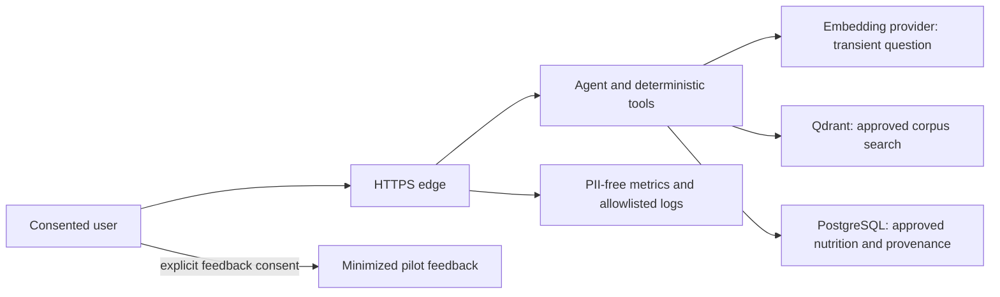

# Privacy Data Flow and Retention

The chat question is processed in memory by the HTTP service and Agent. It is sent to the
configured embedding provider for vectorization, but is not written to application logs or
PostgreSQL. Qdrant receives only the vector query. Metric labels contain route, method,
status, outcome, or dependency—never question text, user identity, IP, or request body.

Pilot feedback is collected only when a consent reference and privacy-notice version are
configured and the participant explicitly accepts consent. Stored fields are the generated
feedback ID, pseudonymous session/request IDs, rating, comprehension flag, optional short
comment, consent/version evidence, release/prompt versions, and timestamp.

Retention is dry-run by default. An actual deletion requires a policy version, authorized
person, evidence reference, the database privacy-erasure transaction flag, and an immutable
retention event. Hosting owners must set the final retention period and validate backups,
replicas, analytics exports, and provider retention separately.

