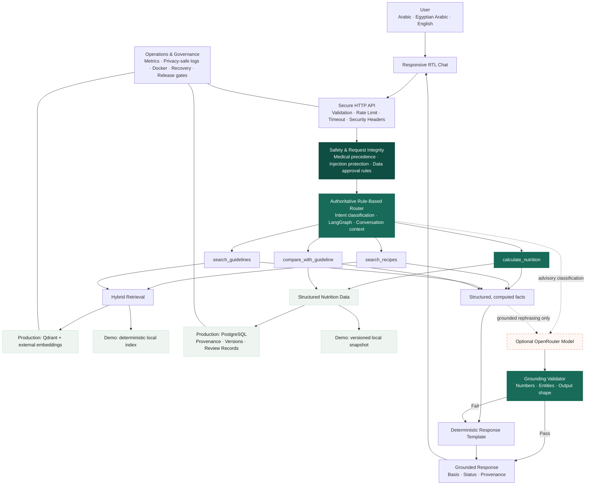

# NutriGuard Architecture Diagram

The high-resolution architecture drawing is available as [nutriguard-architecture.svg](nutriguard-architecture.svg). It can be inserted directly into PowerPoint, Google Slides, or the HTML presentation without losing quality.

## Simplified architecture

## Main architectural rule

The LLM is not the source of nutrition facts. It may provide advisory classification and grounded response wording, but routing remains rule-based and every nutritional number comes from the deterministic calculation pipeline.
